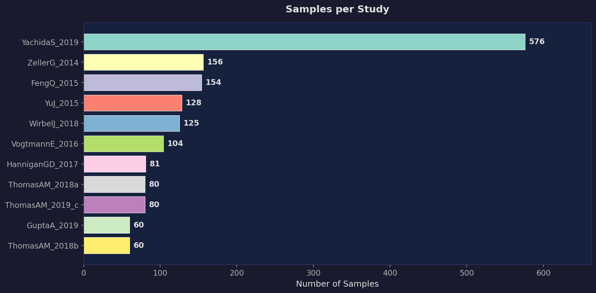
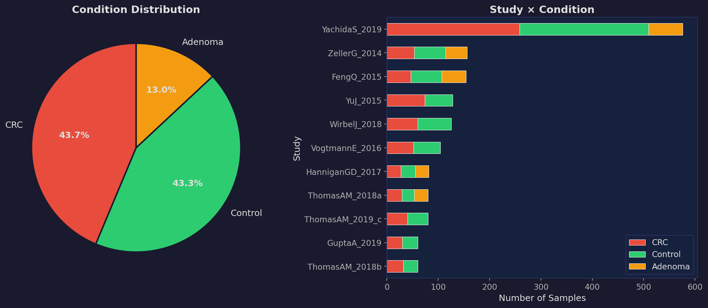
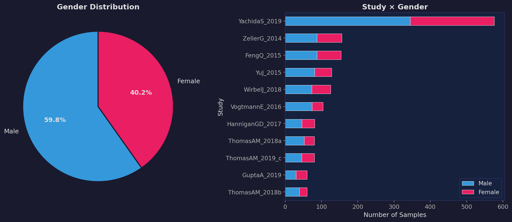
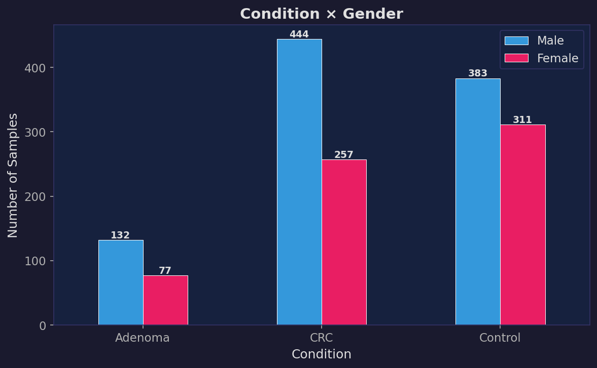
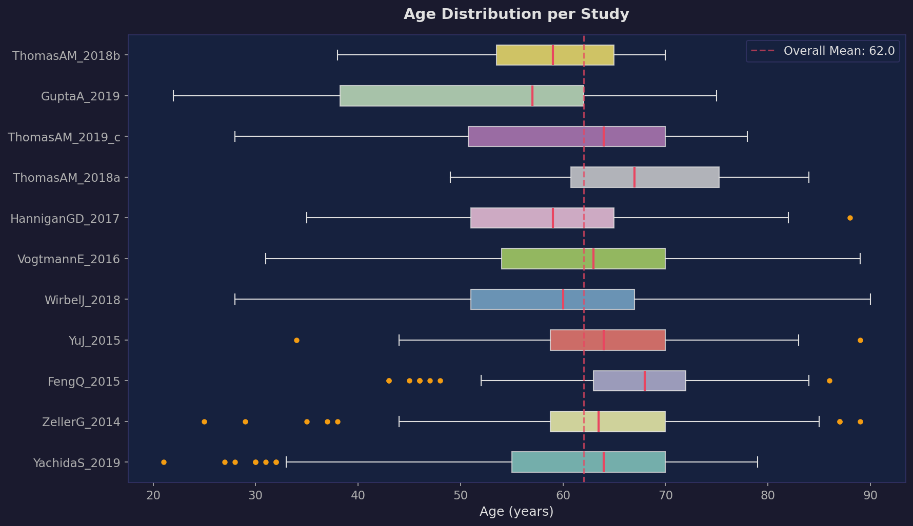
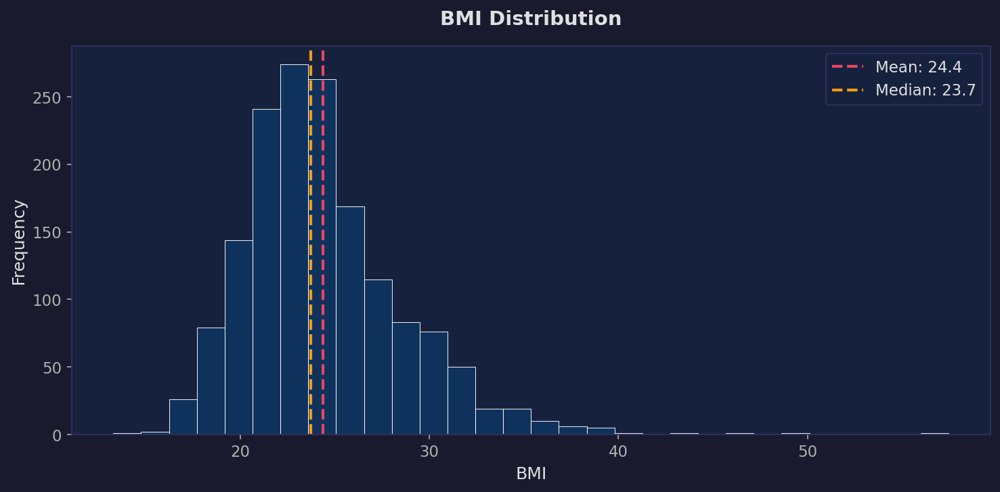
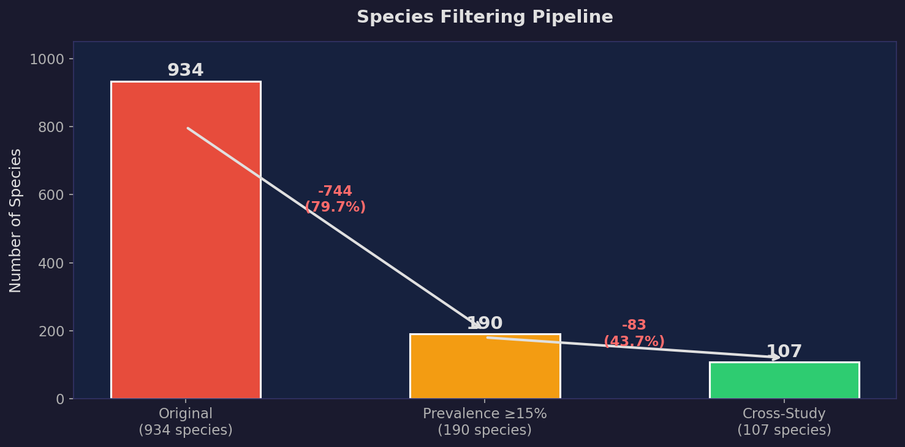
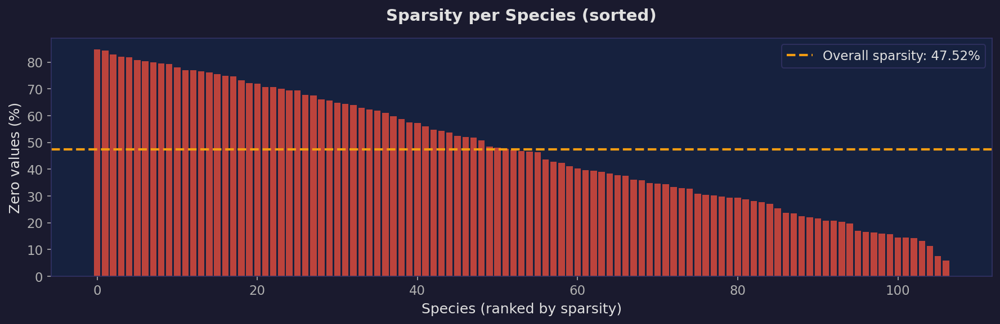

# Περιγραφή & Στατιστική Ανάλυση Dataset — CRC Microbiome Study

> **Πηγή Δεδομένων:** curatedMetagenomicData (Bioconductor)  
> **Pipeline:** MetaPhlAn3 + HUMAnN3 (runDate: 2021-03-31)  
> **Επίπεδο Ανάλυσης:** Species-level taxonomic profiles  

---

## 1. Επισκόπηση Dataset

| Μέτρο | Τιμή |
|---|---|
| **Μελέτες** | 11 |
| **Σύνολο δειγμάτων** | 1,604 |
| **Metadata πεδία / άτομο** | 6 |
| **Αρχικά βακτήρια (species)** | 934 |
| **Βακτήρια μετά filtering** | 107 |
| **Χώρες** | 9 |
| **Ήπειροι** | 3 (Ευρώπη, Ασία, Β. Αμερική) |



---

## 2. Metadata ανά Άτομο (6 πεδία)

Κάθε δείγμα (ασθενής) συνοδεύεται από 6 μεταβλητές:

| Πεδίο | Τύπος | Μοναδικές Τιμές | Κενά | Περιγραφή |
|---|---|---|---|---|
| `Sample` | string | 1,604 | 0 | Μοναδικό αναγνωριστικό δείγματος |
| `Study` | string | 11 | 0 | Μελέτη προέλευσης |
| `Condition` | string | 3 | 0 | CRC / Control / Adenoma |
| `Gender` | string | 2 | 0 | Male / Female |
| `Age` | float | 70 | 1 | Ηλικία σε έτη (21–90) |
| `BMI` | float | 1,002 | 17 | Δείκτης Μάζας Σώματος |

---

## 3. Δείγματα ανά Μελέτη & Χώρα Προέλευσης

| Μελέτη | Δείγματα | % Dataset | Χώρα | Ήπειρος |
|---|---|---|---|---|
| YachidaS_2019 | 576 | 35.9% | 🇯🇵 Ιαπωνία | Ασία |
| ZellerG_2014 | 156 | 9.7% | 🇫🇷 Γαλλία | Ευρώπη |
| FengQ_2015 | 154 | 9.6% | 🇦🇹 Αυστρία | Ευρώπη |
| YuJ_2015 | 128 | 8.0% | 🇨🇳 Κίνα | Ασία |
| WirbelJ_2018 | 125 | 7.8% | 🇩🇪 Γερμανία | Ευρώπη |
| VogtmannE_2016 | 104 | 6.5% | 🇺🇸 ΗΠΑ | Β. Αμερική |
| HanniganGD_2017 | 81 | 5.1% | 🇨🇦🇺🇸 Καναδάς / ΗΠΑ | Β. Αμερική |
| ThomasAM_2018a | 80 | 5.0% | 🇮🇹 Ιταλία | Ευρώπη |
| ThomasAM_2019_c | 80 | 5.0% | 🇯🇵 Ιαπωνία | Ασία |
| GuptaA_2019 | 60 | 3.7% | 🇮🇳 Ινδία | Ασία |
| ThomasAM_2018b | 60 | 3.7% | 🇮🇹 Ιταλία | Ευρώπη |

> **Σημείωση:** Η μελέτη YachidaS_2019 αντιπροσωπεύει το 35.9% του συνολικού dataset. Η Ασία (Ιαπωνία + Κίνα + Ινδία) συνεισφέρει 844 δείγματα (52.6%).

---

## 4. Κατάσταση Υγείας (Condition)

| Condition | Δείγματα | % |
|---|---|---|
| **CRC** (Καρκίνος Παχέος Εντέρου) | 701 | 43.7% |
| **Control** (Υγιείς Μάρτυρες) | 694 | 43.3% |
| **Adenoma** (Αδένωμα) | 209 | 13.0% |



### Study × Condition (αναλυτικά)

| Study | Adenoma | CRC | Control | Σύνολο |
|---|---|---|---|---|
| FengQ_2015 | 47 | 46 | 61 | 154 |
| GuptaA_2019 | – | 30 | 30 | 60 |
| HanniganGD_2017 | 26 | 27 | 28 | 81 |
| ThomasAM_2018a | 27 | 29 | 24 | 80 |
| ThomasAM_2018b | – | 32 | 28 | 60 |
| ThomasAM_2019_c | – | 40 | 40 | 80 |
| VogtmannE_2016 | – | 52 | 52 | 104 |
| WirbelJ_2018 | – | 60 | 65 | 125 |
| YachidaS_2019 | 67 | 258 | 251 | 576 |
| YuJ_2015 | – | 74 | 54 | 128 |
| ZellerG_2014 | 42 | 53 | 61 | 156 |

> **Σημείωση:** Δείγματα Adenoma υπάρχουν μόνο σε 5 από τις 11 μελέτες (FengQ, Hannigan, ThomasAM_2018a, Yachida, Zeller).

---

## 5. Φύλο

| Φύλο | Δείγματα | % |
|---|---|---|
| **Male** | 959 | 59.8% |
| **Female** | 645 | 40.2% |



### Condition × Gender

| Condition | Female | Male | % Female |
|---|---|---|---|
| Adenoma | 77 | 132 | 36.8% |
| CRC | 257 | 444 | 36.7% |
| Control | 311 | 383 | 44.8% |



> **Σημείωση:** Σε όλες τις κατηγορίες υπερτερούν οι άνδρες (αναμενόμενο επιδημιολογικά για CRC). Η ομάδα Control είναι πιο ισορροπημένη (44.8% Female).

---

## 6. Ηλικία & BMI

### Ηλικία

| Μέτρο | Τιμή |
|---|---|
| Mean | 62.0 |
| Median | 64.0 |
| Std | 11.4 |
| Min | 21 |
| Max | 90 |
| Missing | 1 |



### BMI

| Μέτρο | Τιμή |
|---|---|
| Mean | 24.4 |
| Median | 23.7 |
| Missing | 17 |



---

## 7. Filtering (Prevalence & Cross-Study) — Τι καταλήξαμε

### Pipeline Φιλτραρίσματος

| Στάδιο | Species | Αφαιρέθηκαν |
|---|---|---|
| Πριν (αρχικά) | 934 | – |
| Μετά Prevalence Filter (≥ 15%) | 190 | 744 (79.7%) |
| Μετά Cross-Study Filter (≥ 0.1% σε ≥ 3 studies) | **107** | 83 (43.7%) |
| **Συνολικά αφαιρέθηκαν** | | **827 (88.5%)** |



### Φίλτρο 1: Prevalence Filtering
- **Κριτήριο:** Αφαίρεση species που δεν ανιχνεύθηκαν σε τουλάχιστον 15% του συνόλου των δειγμάτων (≥ 241 / 1,604 samples).
- **Αποτέλεσμα:** 934 → 190 species.
- **Στόχος:** Εξάλειψη εξαιρετικά σπάνιων ειδών που εισάγουν στατιστικό θόρυβο λόγω πληθώρας μηδενικών τιμών.

### Φίλτρο 2: Cross-Study Abundance Filtering
- **Κριτήριο:** Διατήρηση μόνο ειδών με μέση σχετική αφθονία ≥ 0.1% (1E-03) σε τουλάχιστον 3 διαφορετικές κλινικές μελέτες.
- **Αποτέλεσμα:** 190 → 107 species.
- **Στόχος:** Αντιμετώπιση batch effect — εξασφάλιση ότι ένα μικρόβιο δεν αποτελεί τεχνητό εύρημα ενός μόνο εργαστηρίου.

### Μετασχηματισμός CLR
Μετά την τελική επιλογή (107 species) εφαρμόστηκε ο **CLR (Centered Log-Ratio) μετασχηματισμός** με pseudocount ίσο με τη μισή ελάχιστη μη-μηδενική τιμή.

### Sparsity Τελικού Πίνακα

| Μέτρο | Τιμή |
|---|---|
| Κελιά πίνακα | 171,628 |
| Μηδενικά (zeros) | 81,562 |
| **Sparsity** | **47.52%** |



---

## 8. Δομή Αρχείων

```
data/crc_study_final_data/species_level/
├── metadata.csv                     (1604 × 6)   — Sample, Study, Condition, Gender, Age, BMI
├── species_filtered_crossstudy.csv  (1604 × 108) — Raw abundances, 107 species + Sample ID
├── species_clr_crossstudy.csv       (1604 × 108) — CLR-transformed, 107 species + Sample ID
├── species_prevalence_stats.csv     (934 × 3)    — Log 1ου φίλτρου: species, prevalence, kept
└── cross_study_filter_log.csv       (190 × 4)    — Log 2ου φίλτρου: αποφάσεις διατήρησης
```

| Αρχείο | Γραμμές | Στήλες | Σκοπός |
|---|---|---|---|
| `metadata.csv` | 1,604 | 6 | Κλινικά / δημογραφικά δεδομένα |
| `species_filtered_crossstudy.csv` | 1,604 | 108 | Σχετικές αφθονίες (%) μετά filtering |
| `species_clr_crossstudy.csv` | 1,604 | 108 | CLR-transformed τιμές για ML ανάλυση |
| `species_prevalence_stats.csv` | 934 | 3 | Prevalence κάθε species & αν κρατήθηκε |
| `cross_study_filter_log.csv` | 190 | 4 | Cross-study αποφάσεις & αριθμός μελετών |
