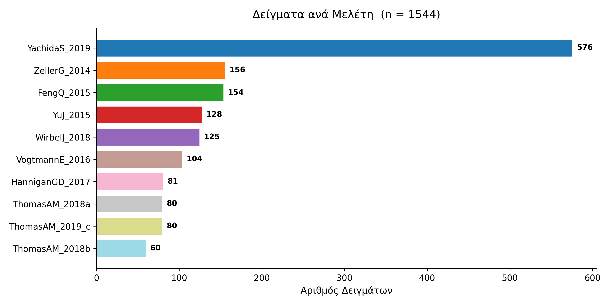
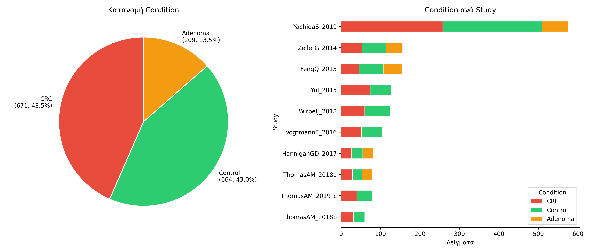
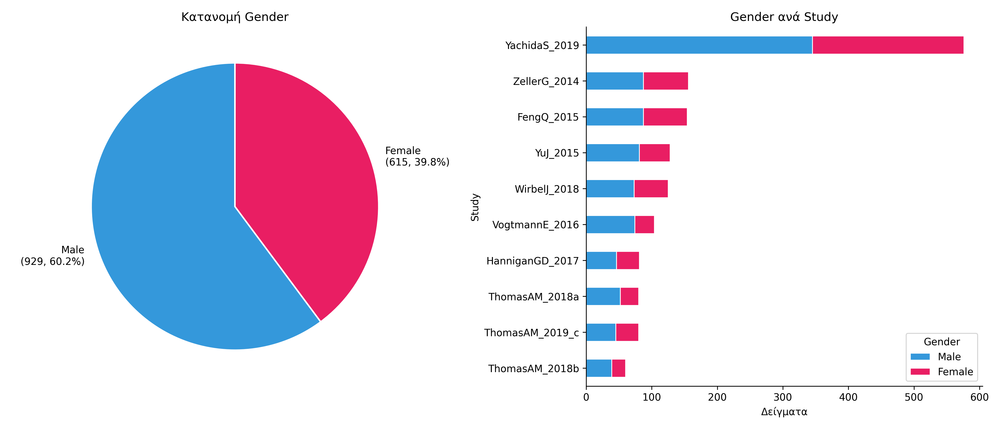
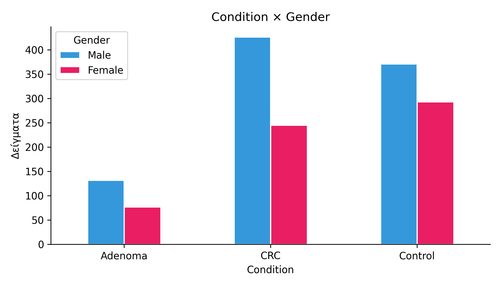
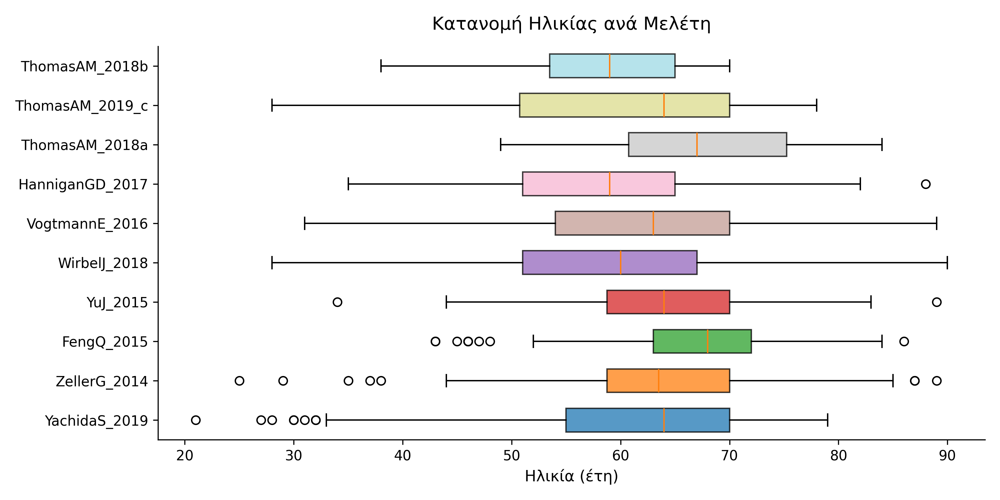
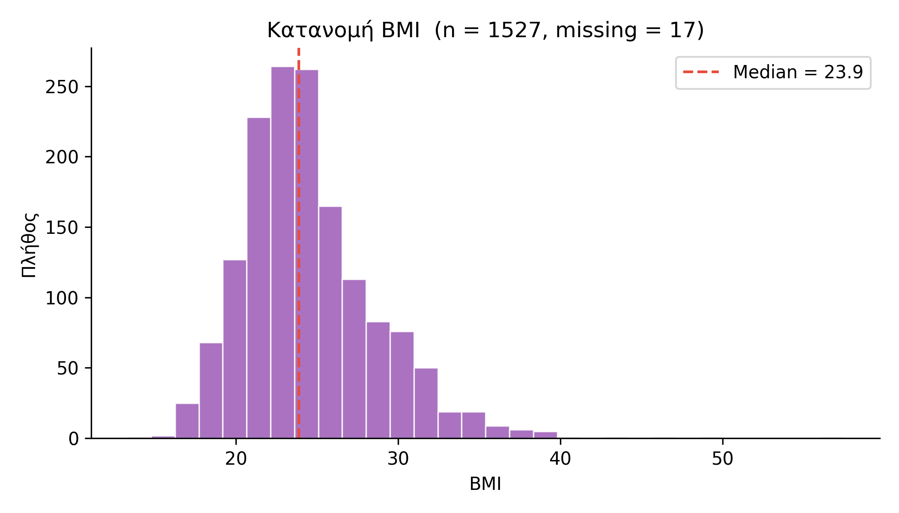
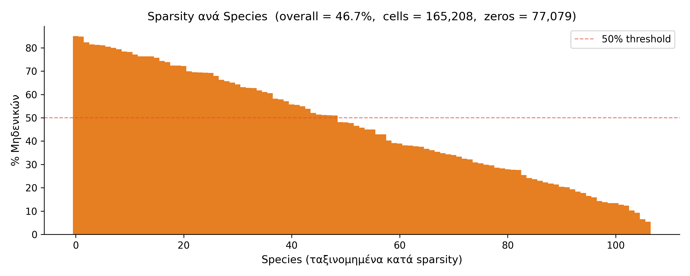

# Περιγραφή & Στατιστική Ανάλυση Dataset — CRC Microbiome Study (Post-Gupta Removal)

> **Πηγή Δεδομένων:** curatedMetagenomicData (Bioconductor)  
> **Pipeline:** MetaPhlAn3 + HUMAnN3 (runDate: 2021-03-31)  
> **Επίπεδο Ανάλυσης:** Species-level taxonomic profiles  

---

## 1. Επισκόπηση Dataset

| Μέτρο | Τιμή |
|---|---|
| **Μελέτες** | 10 |
| **Σύνολο δειγμάτων** | 1,544 |
| **Metadata πεδία / άτομο** | 6 |
| **Αρχικά βακτήρια (species)** | 934 |
| **Βακτήρια μετά filtering** | 107 |
| **Χώρες** | 8 |
| **Ήπειροι** | 3 (Ευρώπη, Ασία, Β. Αμερική) |

---

## 2. Metadata ανά Άτομο (6 πεδία)

| Πεδίο | Τύπος | Μοναδικές Τιμές | Κενά | Περιγραφή |
|---|---|---|---|---|
| `Sample` | string | 1,544 | 0 | Μοναδικό αναγνωριστικό δείγματος |
| `Study` | string | 10 | 0 | Μελέτη προέλευσης |
| `Condition` | string | 3 | 0 | CRC / Control / Adenoma |
| `Gender` | string | 2 | 0 | Male / Female |
| `Age` | float | 66 | 1 | Ηλικία σε έτη |
| `BMI` | float | 964 | 17 | Δείκτης Μάζας Σώματος |

---

## 3. Δείγματα ανά Μελέτη & Χώρα Προέλευσης

| Μελέτη | Δείγματα | % Dataset | Χώρα | Ήπειρος |
|---|---|---|---|---|
| YachidaS_2019 | 576 | 37.3% | 🇯🇵 Japan (JPN) | Ασία |
| ZellerG_2014 | 156 | 10.1% | 🇫🇷 France (FRA) | Ευρώπη |
| FengQ_2015 | 154 | 10.0% | 🇦🇹 Austria (AUT) | Ευρώπη |
| YuJ_2015 | 128 | 8.3% | 🇨🇳 China (CHN) | Ασία |
| WirbelJ_2018 | 125 | 8.1% | 🇩🇪 Germany (DEU) | Ευρώπη |
| VogtmannE_2016 | 104 | 6.7% | 🇺🇸 USA | Β. Αμερική |
| HanniganGD_2017 | 81 | 5.2% | 🇺🇸 USA (87%) + 🇨🇦 Canada (13%) | Β. Αμερική |
| ThomasAM_2018a | 80 | 5.2% | 🇮🇹 Italy (ITA) | Ευρώπη |
| ThomasAM_2019_c | 80 | 5.2% | 🇯🇵 Japan (JPN) | Ασία |
| ThomasAM_2018b | 60 | 3.9% | 🇮🇹 Italy (ITA) | Ευρώπη |

> **Σημείωση:** Η μελέτη YachidaS_2019 αντιπροσωπεύει το 37.3% του συνολικού dataset. Η Ασία (Ιαπωνία + Κίνα) συνεισφέρει 784 δείγματα (50.8%).

---

## 4. Κατάσταση Υγείας (Condition)

| Condition | Δείγματα | % |
|---|---|---|
| **CRC** | 671 | 43.5% |
| **Control** | 664 | 43.0% |
| **Adenoma** | 209 | 13.5% |

### Study × Condition (αναλυτικά)

| Study | Adenoma | CRC | Control | Σύνολο |
|---|---|---|---|---|
| FengQ_2015 | 47 | 46 | 61 | 154 |
| HanniganGD_2017 | 26 | 27 | 28 | 81 |
| ThomasAM_2018a | 27 | 29 | 24 | 80 |
| ThomasAM_2018b | – | 32 | 28 | 60 |
| ThomasAM_2019_c | – | 40 | 40 | 80 |
| VogtmannE_2016 | – | 52 | 52 | 104 |
| WirbelJ_2018 | – | 60 | 65 | 125 |
| YachidaS_2019 | 67 | 258 | 251 | 576 |
| YuJ_2015 | – | 74 | 54 | 128 |
| ZellerG_2014 | 42 | 53 | 61 | 156 |

> **Σημείωση:** Δείγματα Adenoma υπάρχουν μόνο σε 5 από τις 10 μελέτες.

---

## 5. Φύλο

| Φύλο | Δείγματα | % |
|---|---|---|
| **Male** | 929 | 60.2% |
| **Female** | 615 | 39.8% |

### Condition × Gender

| Condition | Female | Male | % Female |
|---|---|---|---|
| Adenoma | 77 | 132 | 36.8% |
| CRC | 245 | 426 | 36.5% |
| Control | 293 | 371 | 44.1% |

---

## 6. Ηλικία & BMI

| Μέτρο | Ηλικία | BMI |
|---|---|---|
| Mean | 62.5 | 24.5 |
| Median | 64.0 | 23.9 |
| Missing | 1 | 17 |

---

## 7. Filtering & Sparsity

| Μέτρο | Τιμή |
|---|---|
| Κελιά πίνακα | 165,208 |
| Μηδενικά (zeros) | 77,079 |
| **Sparsity** | **46.66%** |

